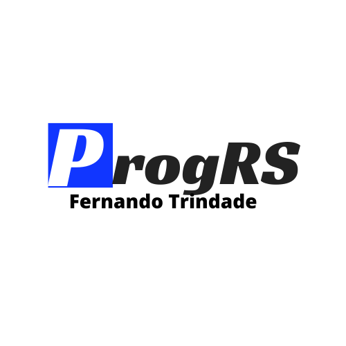

<h1 align="center">
    

</h1>

<h1>

</h1>

# Indice
- [Sobre](#-Sobre)
- [Tecnologias utilizadas](#-Tecnologias-utilizadas)
- [Como baixar o projeto](#-Como-baixar-o-projeto)

# 👨‍💻Sobre

O projeto consiste em um desafio proposto pela empresa **Acerta**, tendo como base as tecnologias utilizadas nas implementações Front-End.
---
## 🚀Tecnologias utilizadas

- [React Router]()
- [Formik]()
- [Yup]()
- [React-icons]()
- [React-input-Mask]()
- [Axios]() 
- [CSS3]()
- [HTML5]()
- [TypeScript]()

---

## 🧲Como baixar o projeto

```bash
# Clonar o repositório
$ git clone https://github.com/ProgRS/Acerta
# Entrar no diretório 
$ cd Acerta
# Instalar as dependências
$ npm instal
# Iniciar o projeto
$ npm start
